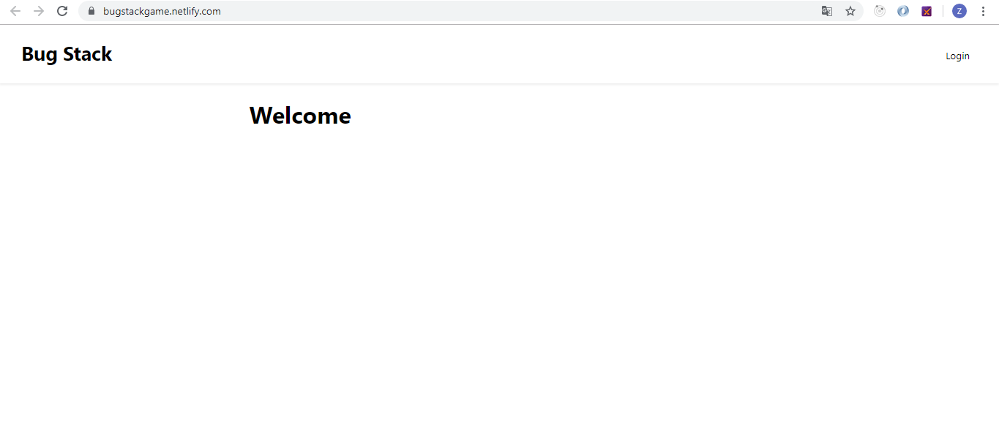

<h1 align="center">Bug Stack Games </h1>

  Built with React

## Table of Contents

- [Introduction](#introduction)
- [Features](#features)
- [Requirements](#requirements)
- [Usage](#usage-for-development)
- [Screenshots](#screenshots)
- [Related Project](#related-project)

## Introduction
Bug Stack game is drum game like real drum app 

## Features
* Login 
* Register
* Change pattern
* And More

## Requirements
* [`npm`](https://www.npmjs.com/get-npm)
* [`reactjs`](https://facebook.github.io/react-native/docs/getting-started)

## Usage for development
1. Open your terminal or command prompt
2. Type `git clone https://github.com/zidni0192/bugStackGame-Web`
3. Open the folder and type `npm install` for install dependencies 
4. Before run this, you must run backend first
5. Type `npm start` 

## Screenshoot

    

## Related Project
* [Back End Bug Stack Game](https://github.com/zidni0192/bugStackGame-BackEnd)

## Demo
* https://bugstackgame.netlify.com/